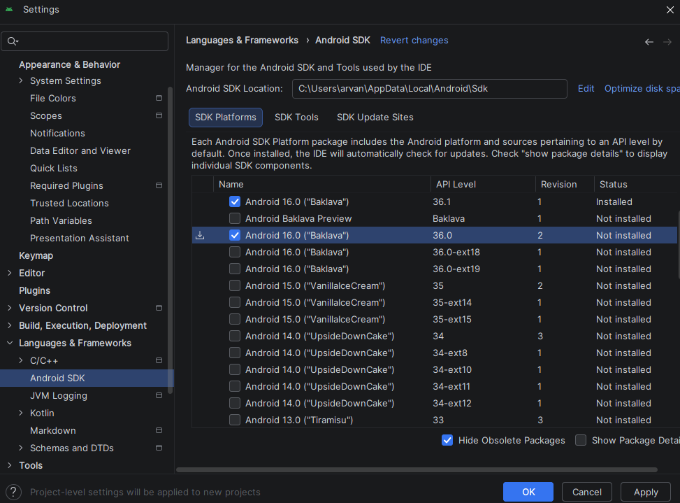

<div align="center">
  <br />

  <h1>LAPORAN PRAKTIKUM <br>
  APLIKASI BERBASIS PLATFORM
  </h1>

  <br />

  <h3>MODUL - 1,2,3<br>
    Pengenalan Flutter dan Dart
  </h3>

  <br />

  

  <br />
  <br />
  <br />

  <h3>Disusun Oleh :</h3>

  <p>
    <strong>Arnanda Setya Nosa Putra</strong><br>
    <strong>2311102180</strong><br>
    <strong>S1 IF-11-04</strong>
  </p>

  <br />

  <h3>Dosen Pengampu :</h3>

  <p>
    <strong>Cahyo Prihantoro, S.Kom., M.Eng.</strong>
  </p>
  
  <br />

  <h3>LABORATORIUM HIGH PERFORMANCE
  <br>FAKULTAS INFORMATIKA <br>UNIVERSITAS TELKOM PURWOKERTO <br>2026</h3>
</div>

<hr>

---

# 1. Dasar Teori

Flutter adalah framework open-source yang dikembangkan oleh Google untuk
membangun aplikasi lintas platform seperti mobile, web, dan desktop hanya dengan
satu codebase. Flutter menggunakan bahasa pemrograman Dart serta didukung oleh
Skia Graphics Engine untuk merender tampilan secara langsung ke layar tanpa
bergantung pada komponen native. Salah satu keunggulan utama Flutter adalah
fitur hot reload yang memungkinkan developer melihat perubahan kode secara
langsung tanpa harus melakukan build ulang aplikasi, sehingga proses
pengembangan menjadi lebih cepat dan efisien.

Dalam pengembangan antarmuka, Flutter menggunakan konsep widget tree, yaitu
struktur hierarkis di mana seluruh elemen UI dibangun dari widget. Widget ini
terbagi menjadi dua jenis utama, yaitu stateless widget yang tidak memiliki
state (data tidak berubah) dan stateful widget yang memiliki state yang dapat
berubah selama aplikasi berjalan. Struktur dasar aplikasi Flutter biasanya
dimulai dari MaterialApp sebagai root aplikasi, kemudian Scaffold sebagai
kerangka utama layout yang menyediakan komponen seperti AppBar dan body, serta
widget lain seperti Text dan Center untuk menampilkan dan mengatur posisi konten.

Untuk pengelolaan arsitektur, Flutter mendukung berbagai pendekatan, salah
satunya adalah BLoC (Business Logic Component). Pola ini bertujuan untuk
memisahkan logika bisnis dari tampilan dengan menggunakan konsep event dan
state, sehingga aplikasi menjadi lebih terstruktur, mudah dikembangkan,
scalable, dan lebih mudah untuk diuji. Sebagai langkah awal pembelajaran,
biasanya developer membuat aplikasi sederhana seperti “Hello World” untuk
memahami struktur dasar Flutter dan cara kerja widget dalam membangun
tampilan aplikasi.

---

# 2. Screenshot Tampilan Environment & Hasil

## Verifikasi SDK Android Studio

_(Penjelasan: Screenshot SDK Manager untuk memastikan build tools aman)_

<p>



</p>

## Struktur Proyek Baru

_(Penjelasan: Screenshot struktur direktori proyek Flutter di IDE)_

<p>


</p>

## Verifikasi Instalasi Flutter (Flutter Doctor)

_(Penjelasan: Screenshot terminal hasil `flutter doctor -v` untuk memastikan
seluruh dependensi terinstal dengan benar dan aman dari celah environment)_

<p>


</p>

## Source Code Hello World

```dart
import 'package:flutter/material.dart';

void main() {
  runApp(const MyApp());
}

class MyApp extends StatelessWidget {
  const MyApp({Key? key}) : super(key: key);

  @override
  Widget build(BuildContext context) {
    return const MaterialApp(
      title: "Hello World",
      debugShowCheckedModeBanner: false,
      home: MyHomePage(title: "Flutter Hello World Page"),
    );
  }
}

class MyHomePage extends StatefulWidget {
  const MyHomePage({Key? key, required this.title}) : super(key: key);

  final String title;

  @override
  State<MyHomePage> createState() => _MyHomePageState();
}

class _MyHomePageState extends State<MyHomePage> {
  @override
  Widget build(BuildContext context) {
    return Scaffold(
      appBar: AppBar(
        title: Text(widget.title),
      ),
      body: const Center(
        child: Text(
          'Hello World',
          style: TextStyle(
            fontSize: 24,
            fontWeight: FontWeight.bold,
          ),
        ),
      ),
    );
  }
}
```

## Hasil Running Hello World

<p>


</p>

---

# 3. MODUL 03 - Pengenalan Dart

## 3.1. Pengenalan Dart

Untuk belajar Flutter, tidak perlu terlalu fasih mempelajari bahasa Dart secara
mendalam di awal. Terdapat fundamental yang perlu dipelajari seperti variable,
statement control, looping, array, fungsi, dan sebagainya. Karakteristik bahasa
Dart mirip dengan bahasa C atau Java, di mana penggunaan titik koma (`;`)
diakhir baris kodingan adalah wajib.

## 3.1.1. Variable

Penggunaan variable di Dart dapat dilakukan dengan beberapa cara, yaitu
menggunakan `var`, _type annotation_, dan _multiple variable_.

**Contoh Kode:**

```dart
// var
var namaVariable = nilai;

// type annotation
String nama = "Arnanda";
int umur = 20;

// multiple variable
var a = 1, b = 2, c = 3;
```

Variable primitif yang tersedia di Dart:

Integer (int)

Double (double)

String (string)

Boolean (bool)

### Screenshot Hasil Variable:


## 3.1.2. Statement Control

Statement control digunakan untuk menentukan alur eksekusi program.
Dart mendukung if, if-else, if-else-if, dan switch-case.

Contoh Struktur Switch Case:

```Dart
switch(expression) {
  case value1:
    // statements
    break;
  case value2:
    // statements
    break;
  default:
    // statements
    break;
}
```

### Screenshot Hasil Statement Control:


## 3.1.3. Looping

Terdapat dua cara utama untuk melakukan perulangan di Dart:

For Loops: Digunakan saat jumlah perulangan sudah diketahui pasti.

While Loops: Digunakan saat kondisi berhenti tidak diketahui secara pasti
(tergantung pada ekspresi logika).

Screenshot Hasil Looping:


## 3.1.4. List

Dalam Dart, kumpulan data dalam satu variabel disebut List (di bahasa lain
sering disebut Array).

Fixed Length List: Memiliki panjang indeks yang tetap.

```Dart
var newList = List.filled(3, 0); // Contoh modern
newList[0] = 12;
```

Growable List: Digunakan jika jumlah objek tidak menentu atau terus
bertambah.

```Dart
var growableList = [];
growableList.add(12);
```

### Screenshot Hasil List:


## 3.1.5. Fungsi (Function)

Fungsi sangat penting dalam pemrograman berbasis objek untuk menerapkan prinsip
Separation of Concern. Program yang baik harus mengurangi boilerplate code dan memiliki tanggung jawab yang spesifik.

Contoh Fungsi Rekursif (Faktorial):

```Dart
factorial(number) {
  if (number <= 0) {
    return 1;
  } else {
    return (number * factorial(number - 1));
  }
}
```

### Screenshot Hasil Fungsi:


### Referensi

- Flutter Docs: [https://docs.flutter.dev](https://docs.flutter.dev)
- Modul 1 dan 2 Praktikum Aplikasi Berbasis Platform
